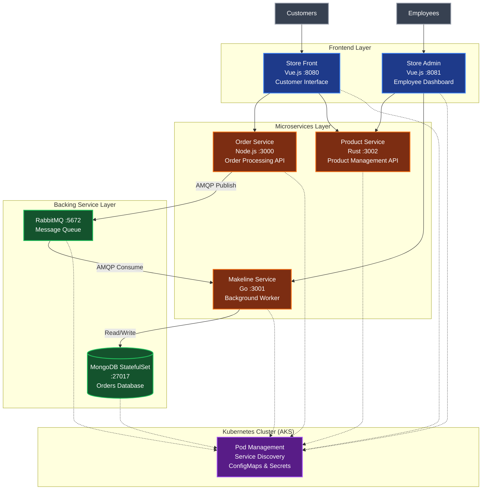

# Best Buy Cloud-Native Application

[Video](https://youtu.be/DRTJQWCyFYo)

A comprehensive microservices-based e-commerce platform built for Best Buy, demonstrating modern cloud-native development practices. This application follows the Algonquin Pet Store architecture pattern and consists of 5 microservices with MongoDB database, designed for scalability and maintainability in the cloud.

## Architecture Diagram



## Application Overview

### Purpose
This Best Buy cloud-native application demonstrates modern e-commerce capabilities through a microservices architecture. It enables customers to browse products and place orders while providing employees with comprehensive order management and product administration tools.

### Core Business Features
- **Customer Experience**: Product browsing, shopping cart, order placement
- **Employee Tools**: Order tracking, product management, kitchen/fulfillment operations
- **Real-time Processing**: Asynchronous order processing through message queues
- **Scalable Architecture**: Independent microservices for different business domains

### Microservices Breakdown

| Service | Technology Stack | Port | Business Purpose | Technical Role |
|---------|------------------|------|------------------|----------------|
| **Store Front** | Vue.js 3 | 8080 | Customer product browsing and ordering | Customer-facing web interface |
| **Store Admin** | Vue.js 3 | 8081 | Employee order and product management | Internal administrative dashboard |
| **Order Service** | Node.js + Fastify | 3000 | Order entry and validation | API gateway for order processing |
| **Product Service** | Rust + Actix-web | 3002 | Product catalog management | Product CRUD operations with WASM rules |
| **Makeline Service** | Go + Gin | 3001 | Order fulfillment processing | Background worker for order status updates |

### Infrastructure Components
- **MongoDB StatefulSet**: Persistent order and customer data storage
- **RabbitMQ**: Asynchronous message processing between services
- **Kubernetes (AKS)**: Container orchestration and service management

## Deployment Instructions

### Prerequisites
- Azure Kubernetes Service (AKS) cluster or local Kubernetes
- kubectl configured for your cluster
- Docker Hub account for container images

### Step-by-Step Deployment

#### 1. **Clone and Prepare Repository**
```bash
git clone https://github.com/coreyms94/CST8915-Final-Project.git
cd CST8915-Final-Project
```

#### 2. **Build and Push Container Images**
```bash
# Update Docker Hub username in deployment files
# Run build script
./build-and-push.bat

# Or build individually
cd order-service-final && docker build -t coreyms94/order-service:latest .
cd ../product-service-final && docker build -t coreyms94/product-service:latest .
cd ../makeline-service-final && docker build -t coreyms94/makeline-service:latest .
cd ../store-front-final && docker build -t coreyms94/store-front:latest .
cd ../store-admin-final && docker build -t coreyms94/store-admin:latest .
```

#### 3. **Deploy to Kubernetes**
```bash
# Navigate to deployment files
cd Deployment-Files/

# Deploy secrets and configuration first
kubectl apply -f secrets.yaml
kubectl apply -f config-maps.yaml

# Deploy all services using the all-in-one file
kubectl apply -f aps-all-in-one.yaml

# Wait for infrastructure to be ready
kubectl wait --for=condition=ready pod -l app=mongodb --timeout=300s
kubectl wait --for=condition=ready pod -l app=rabbitmq --timeout=300s
```

#### 4. **Verify Deployment**
```bash
# Check all pods are running
kubectl get pods

# Check services and external IPs
kubectl get services

# Check StatefulSet status
kubectl get statefulsets
```

#### 5. **Access Application**
```bash
# Get external IPs from LoadBalancer services
kubectl get services store-front store-admin

# Access using external IPs (replace with actual IPs from above command):
# Customer Store: http://<STORE-FRONT-EXTERNAL-IP>
# Admin Dashboard: http://<STORE-ADMIN-EXTERNAL-IP>

# Alternative: Use port forwarding for local testing
kubectl port-forward service/store-front 8080:80 &
kubectl port-forward service/store-admin 8081:80 &

# Access via port forwarding:
# Customer Store: http://localhost:8080
# Admin Dashboard: http://localhost:8081
```

### Local Development Setup

#### 1. **Infrastructure Services**
```bash
# Start databases and message queue
docker run -d --name mongodb -p 27017:27017 mongo:7.0
docker run -d --name rabbitmq -p 5672:5672 -p 15672:15672 rabbitmq:3.12-management
```

#### 2. **Run Microservices**
```bash
# Terminal 1 - Order Service
cd order-service-final
npm install && npm start

# Terminal 2 - Product Service  
cd product-service-final
cargo run

# Terminal 3 - Makeline Service
cd makeline-service-final
go mod tidy && go run .

# Terminal 4 - Store Front
cd store-front-final
npm install && npm run serve

# Terminal 5 - Store Admin
cd store-admin-final
npm install && npm run serve
```

## CI/CD Pipeline

The project includes GitHub Actions workflows for automated:
- **Multi-architecture builds** (AMD64, ARM64)
- **Container security scanning**
- **Automated testing**
- **Deployment to AKS staging/production environments**

### Workflow Configuration
Located in `.github/workflows/ci_cd.yaml`, the pipeline triggers on:
- Push to main branch
- Pull request creation
- Manual workflow dispatch

## Links Table

### Repository Links
| Component | Repository URL |
|-----------|----------------|
| **Main Project** | [https://github.com/coreyms94/CST8915-Final-Project](https://github.com/coreyms94/CST8915-Final-Project) |
| Order Service | [./order-service-final/](https://github.com/CoreyCauterize/order-service-final) |
| Product Service | [./product-service-final/](https://github.com/CoreyCauterize/product-service-final) |
| Makeline Service | [./makeline-service-final/](https://github.com/CoreyCauterize/makeline-service-final) |
| Store Front | [./store-front-final/](https://github.com/CoreyCauterize/store-front-final) |
| Store Admin | [./store-admin-final/](https://github.com/CoreyCauterize/store-admin-final) |
| Deployment Files | [./Deployment-Files/](https://github.com/CoreyCauterize/CST8915-Final-Project/tree/main/Deployment-Files) |

### Docker Hub Image Links
| Service | Docker Hub Repository |
|---------|----------------------|
| **Order Service** | [`coreyms94/order-service:latest`](https://hub.docker.com/r/coreyms94/order-service) |
| **Product Service** | [`coreyms94/product-service:latest`](https://hub.docker.com/r/coreyms94/product-service) |
| **Makeline Service** | [`coreyms94/makeline-service:latest`](https://hub.docker.com/r/coreyms94/makeline-service) |
| **Store Front** | [`coreyms94/store-front:latest`](https://hub.docker.com/r/coreyms94/store-front) |
| **Store Admin** | [`coreyms94/store-admin:latest`](https://hub.docker.com/r/coreyms94/store-admin) |

## API Endpoints

### Service Communication
| Service | Endpoint | Method | Purpose |
|---------|----------|--------|---------|
| **Order Service** | `/` | POST | Submit new order |
| | `/health` | GET | Health check |
| **Product Service** | `/` | GET | List all products |
| | `/{id}` | GET | Get product details |
| | `/` | POST | Create new product |
| | `/{id}` | PUT | Update product |
| | `/{id}` | DELETE | Remove product |
| **Makeline Service** | `/order/fetch` | GET | Get pending orders |
| | `/order/{id}` | GET | Get order status |
| | `/order` | PUT | Update order status |

## Technology Stack & Architecture Decisions

### Frontend Technologies
- **Vue.js 3**: Modern reactive framework for responsive user interfaces
- **Vue Router**: Client-side routing for SPA functionality

### Backend Technologies
- **Node.js (Fastify)**: High-performance REST API with plugin ecosystem
- **Rust (Actix-web)**: Memory-safe, high-performance service with WebAssembly support
- **Go (Gin)**: Efficient concurrent processing for background tasks

### Infrastructure Choices
- **MongoDB StatefulSet**: Document database for flexible order data schemas
- **RabbitMQ**: Reliable message queuing for asynchronous processing
- **Kubernetes**: Container orchestration for scalability and resilience
- **Azure Kubernetes Service**: Managed Kubernetes for production deployment

## Project Structure
```
CST8915-Final-Project/
├── README.md                          # This documentation
├── Deployment-Files/                  # Kubernetes manifests
│   ├── aps-all-in-one.yaml          # Complete application deployment
│   ├── secrets.yaml                  # Kubernetes secrets
│   ├── config-maps.yaml             # Configuration data
│   └── DEPLOYMENT-GUIDE.md          # AKS deployment instructions
├── order-service-final/              # Node.js order API
├── product-service-final/            # Rust product API  
├── makeline-service-final/           # Go background worker
├── store-front-final/                # Vue.js customer app
├── store-admin-final/                # Vue.js admin app
├── ci_cd.yaml                        # GitHub Actions workflow
└── build-and-push.bat               # Container build script
```

## Development Team

**Course**: CST8915 - Full-Stack Cloud-Native Development  
**Institution**: Algonquin College  
**Project**: Best Buy Cloud-Native Application (Final Project)  
**Semester**: Winter 2026  
**Architecture Pattern**: Microservices (inspired by Algonquin Pet Store)  

---

*This project demonstrates modern cloud-native development practices including microservices architecture, containerization, Kubernetes orchestration, and CI/CD pipeline implementation for Best Buy's e-commerce platform.*